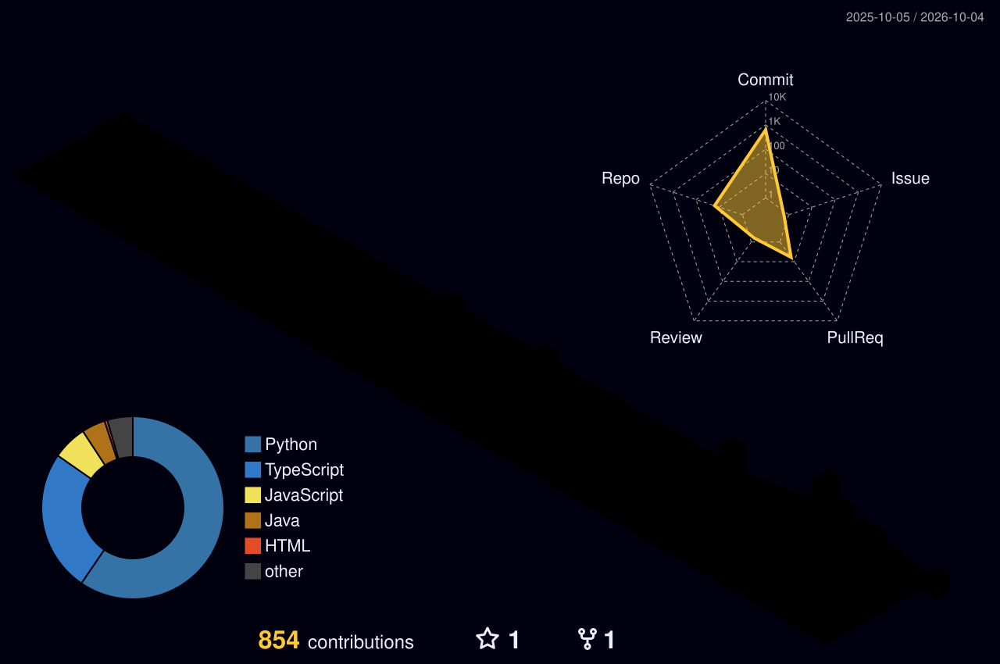

  

  

  
  
  
  

## 👋 About Me

I'm **Chaitanya**, a backend developer who enjoys designing reliable, scalable systems. I'm currently growing into cloud infrastructure and distributed systems, with a focus on building technology for healthcare.

| | |
|:--|:--|
| 🎓 **Education** | B.Tech in Computer Engineering |
| 💼 **Role** | Backend Developer · Cloud Enthusiast · System Design Learner |
| 🎯 **Current Focus** | Distributed Systems · Cloud Infrastructure · Backend Architecture · Healthcare Technology |
| 🌱 **Learning** | Kubernetes · AWS · Microservices · System Design |

## ⚡ Tech Stack

| | |
|:--|:--|
| **Languages** |  |
| **Frontend** |  |
| **Backend & APIs** |  |
| **Databases** |  |
| **DevOps** |  |
| **Tools** |  |

## 🚀 Featured Projects

| Project | Description |
|:--|:--|
| 🤖 **SnapstudioAI** | AI-powered image editing platform |
| 🛡️ **ReachGuard** | Smart safety and security platform |
| 🎓 **Navonmesh 2026** | Official website of the technical fest |
| 📈 **NiveshLoop** | Stock market learning platform with trading simulation |

➡️ [See all repositories](https://github.com/chaitanyabhujbal912006-afk?tab=repositories)

## 🏙️ My Contribution City

  

## 📌 Current Goals

- [ ] Master backend development
- [ ] Earn an AWS certification
- [ ] Learn advanced system design
- [ ] Build AI-powered products
- [ ] Contribute to open source

## 📚 Currently Exploring

  

## 📫 Let's Connect

Always happy to talk about backend engineering, cloud, or healthcare tech. Feel free to reach out.

  
  
  
  

  

